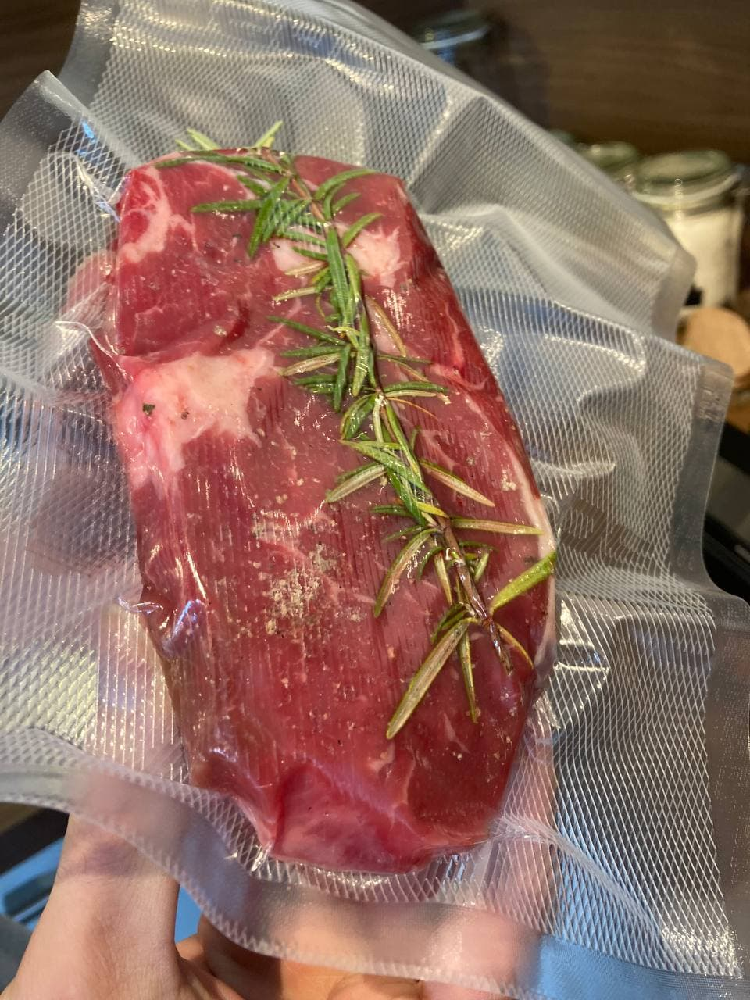
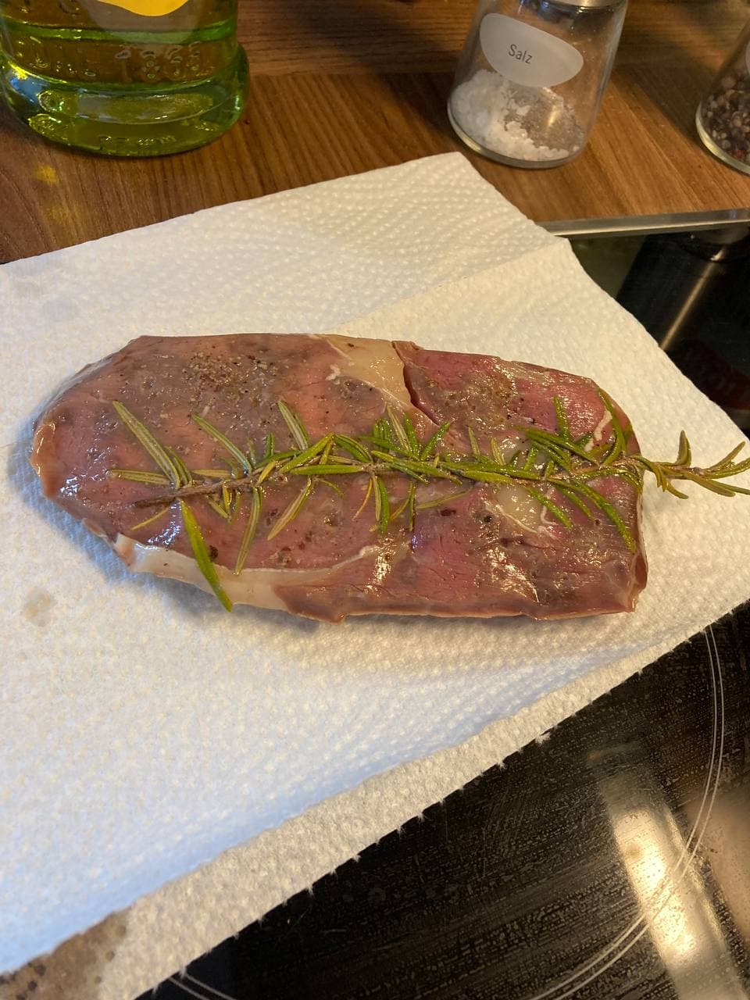
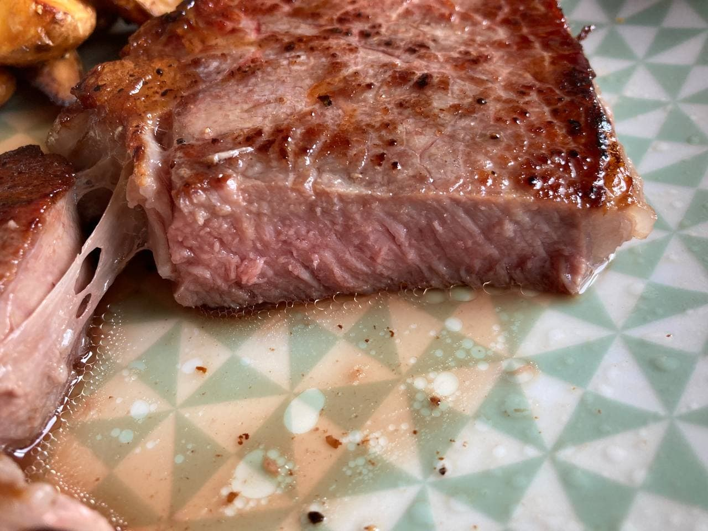

Recently we tried out sous vide cooking and needed quite some time to find well-sounding parameters in the internet or cookbooks.

To preserve the tweaks we did to them I wanted to put them up here, also some of you might want to give it a try too.

## Baseline Parameters

The following parameters can be used for a cold start and might need adjustments depending on your tools and taste.

### Duration

| Steak thickness | cooking time |
|----------------|--------------|
| 2 cm | 60 min |
| 3 cm | 90 min |
| 4 cm | 120 min |
| 5 cm | 160 min |
| 6 cm | 210 min |
| 7 cm | 240 min |
| 8 cm | 180 min |

### Temperature

| cooking level | temperature |
|----------------|--------------|
| blue rare | 40°C - 45°C |
| rare | 45°C - 50°C |
| medium rare | 50°C - 54°C |
| medium | 54°C - 56°C |
| medium-well | 56°C - 60°C |
| well-done | 60°C - 65°C |

## First Try

For the first try we bought a **Dry Aged Entrecote (Rib Eye)** from a **Simmental cattle (Simmentaler)** with a thickness of 2.5 cm to 3 cm.

We wanted a *medium-rare* steak with a tendency to *rare* and therefore configured out sous vide device to heat the water to 52°C for 90 minutes.

For our taste it was almost *medium* so next time we will lower either the time or the temperature.

