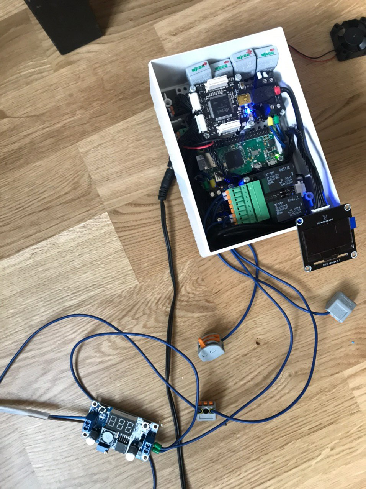
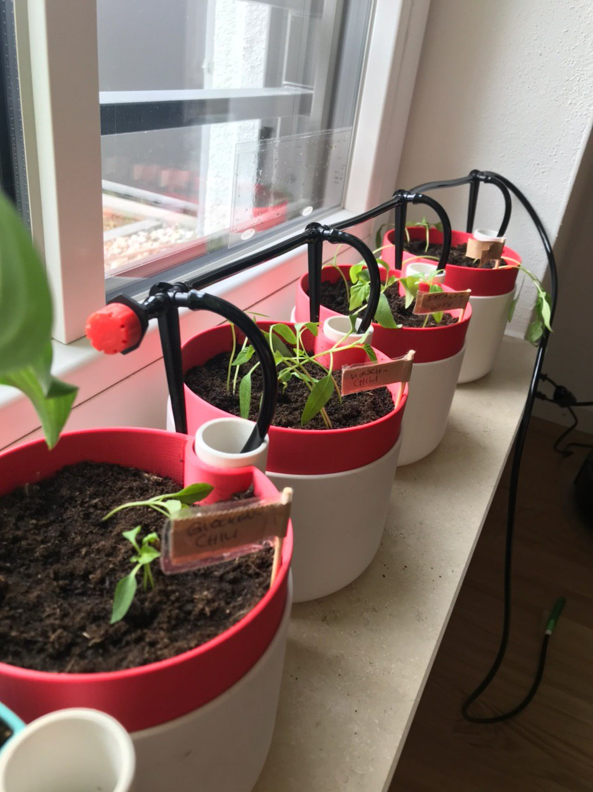
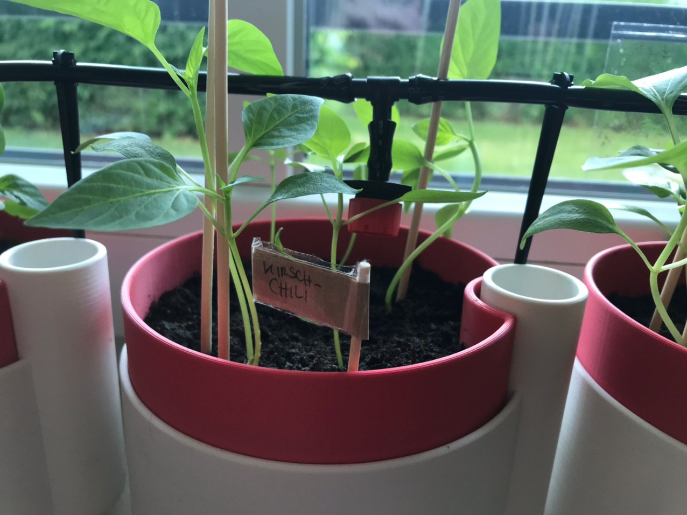
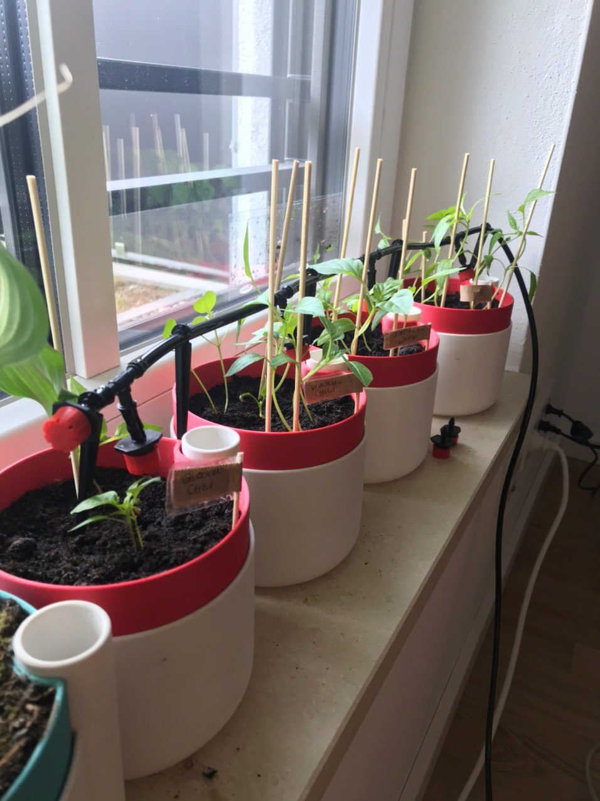
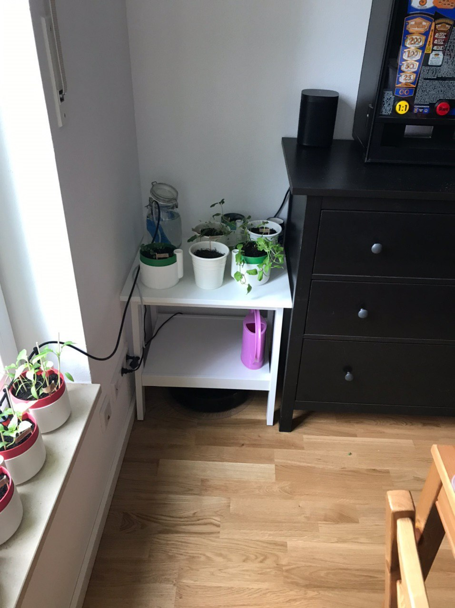
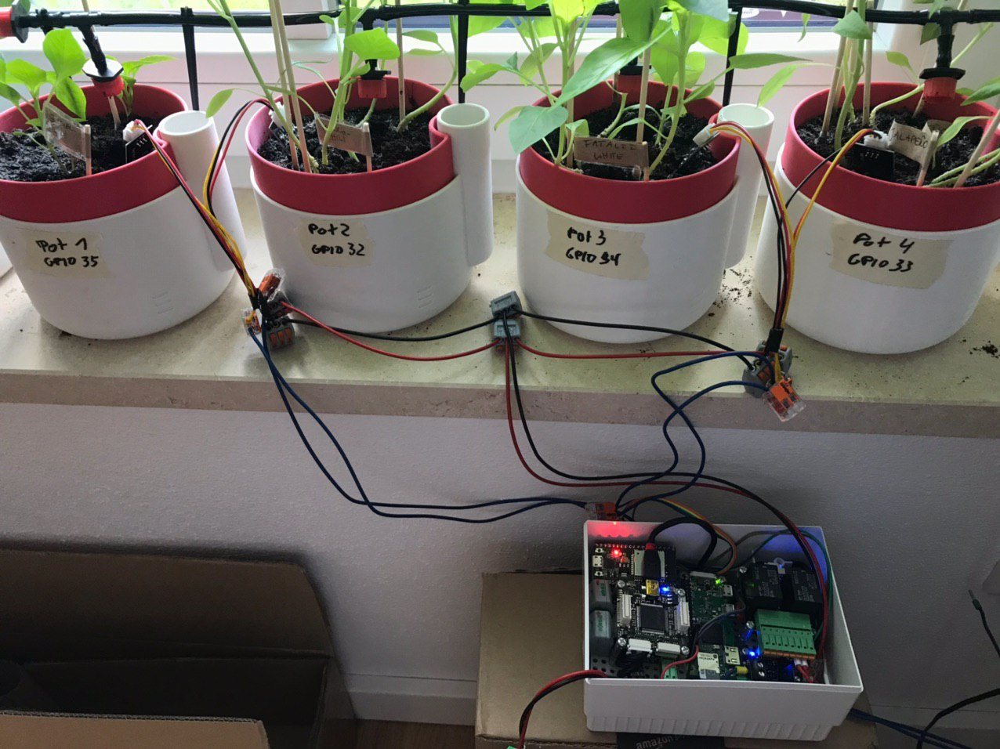

In 2020 I remembered a [Self-Watering Planter](https://www.thingiverse.com/thing:903411) I printed a few years ago and thought it would be nice to reuse this one to replace my chunky prototype with a cleaner and more aesthetic version.

Since I grew a lot of chilis that needed a similiar amount of water, I thought it would be easier to only use one pump and chain the pots together. This would reduce the amount of pumps needed and also the amount of (expensive Tinkerforge) relais.

I revived my control unit and bought a new 12V pump.

I printed a couple of pots for my new chilli plants and lined them up on my windowsill.

As you can see here, the idea here is to use the built-in reservoir of the pots to water the plants. I used [a generic DIY watering kit](https://www.amazon.de/gp/product/B07MGWQTX1) for tubing everything up.

In an additional overhaul I improved the tubing and placed everything nice and clean. As you can see, this is already a huge improvement from lil` chonker in the beginning.

One difficulty was that plants need more water the more they grow. They also started to diverge on their water requirements. I thought I might run into trouble if the reservoir fills more and more and the plants will stand in water at some point. Especially chilis do not like that. So I needed a way to check the moisture of the pots.

Therefore I ordered a set of [moisture sensors](https://www.az-delivery.de/products/bodenfeuchte-sensor-modul-v1-2?variant=12461193920608) (make sure you buy capacitive ones as they last longer) and wired them up to a [ESP8266](https://www.espressif.com/en/products/socs/esp8266) (I have mine soldered to a nodeMCU 0.9) and stuffed into my controller box.

The capacitive sensors return an analog value depending on how much water they have contact with. I noted down the value of air and pure water to use as a reference. After that, I wrote a little programm for my ESP to return these values.



I hooked everything up to my [Prometheus](https://prometheus.io/) and [Grafana](https://grafana.com/) and from now on, I had some values to monitor while the plants were automatically watered.

I soon noticed that the numbers were a little off but it was precised enough for me to continue to compact the setup.