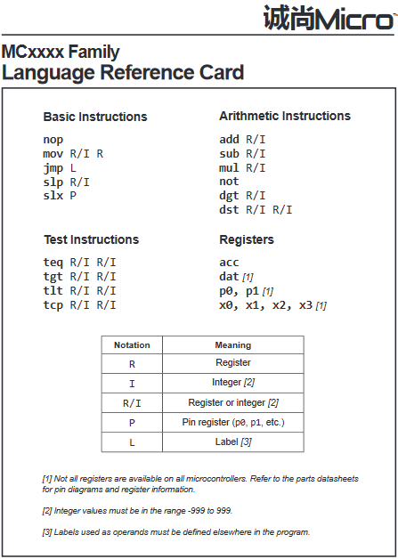

A few days ago I tried out [SHENZHEN I/O](https://store.steampowered.com/app/504210/SHENZHEN_IO/). It is some kind of puzzle game in which you need to solve little tasks using assembler and programming a microcontroller.

The solution is then ranked in three categories and compared to friends:

- Product Cost: depends on the hardware you did choose
- Power Usage: Is increased with more complex and expensive commands
- Lines of code

There is no tutorial. All you have is a 50 sheet documentation about the chips an the commands. That sounds pretty shitty in the beginning but is a nice, realistic thing I started to like pretty quickly. It's like doing an exam with docs allowed.

In the beginning of the manual there is a quick overview over some of the available commands. I'll go through some of them as we use them.




In the first puzzle the task is to match a given pattern with two LEDs.


The first LED (active) is already done as an example:

```nasm
  mov 0 p0
  slp 6
  mov 100 p0
  slp 6
```

To solve the puzzle I did come up with an rather straigh forward solution.

Most instructions to take operands like `R/I` and `R`. `R` Does stand for a register and `I` for a integer. Means, with `R/I` you can pass both a register or an integer to the instruction.

Let's start with `mov [R/I] [R]`. It takes two arguments and copies the value of the first operand into the second. The second command is `slp` which stands for sleep and only takes one argument. The operand specifies the number of time units the process will sleep.

In the graph high is 100 and low 0, to solve it we simple need to match the patter, with the both commands above this is quite easy:

```nasm
  mov 0 p0
  slp 4
  mov 100 p0
  slp 2
  mov 0 p0
  slp 1
  mov 100 p0
  slp 1
```