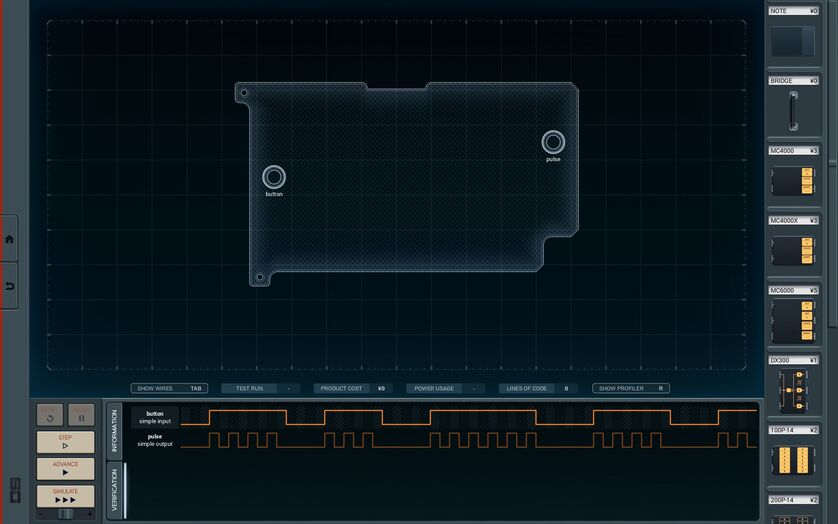

Another day another Shenzhen I/O puzzle.

> In order to test some of our new manufacturing equipment, we need a pulse generator with certain requirements (specifications).
> However, instead of buying one at the market price, I thought we could simply create our own.
> For this project you will need to make use of *conditional execution*.
> Please continue your study of the language reference. 

As a refresher, checkout the Language Reference Card [in the first post](/posts/2021/shenzhen-io-1/).

This puzzle is more complicated because the in- and output does differ from the puzzles before:

Maybe you noticed that in-/output are not synchronous. This means, if we have an input signal, we do not necessarily have a output signal and vice versa.

With these four lines we pass all the tests easily.

| Production Cost | Power Usage | Lines of Code |
|-----------------|-------------|---------------|
|3|240|5|
|3|142|3|