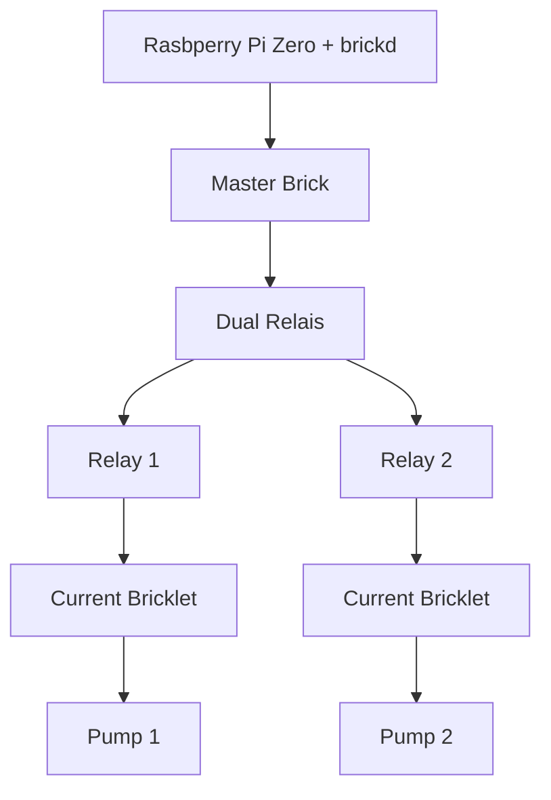

import { Image } from 'astro:assets';
import b1 from '../../../../assets/blumentopf-1/01.jpg';
import b2 from '../../../../assets/blumentopf-1/02.jpg';
import b3 from '../../../../assets/blumentopf-1/03.jpg';
import b4 from '../../../../assets/blumentopf-1/04.jpg';
import b5 from '../../../../assets/blumentopf-1/05.jpg';
import b6 from '../../../../assets/blumentopf-1/06.jpg';
import b7 from '../../../../assets/blumentopf-1/07.jpg';

Four years ago I started working on a never ending side project with which I wanted to automate the watering of some of my plants.

I fiddled around with a few modules from [Tinkerforge](https://www.tinkerforge.com/en/) which I love for jumping into a project. The modules are relatively pricey but have an excellent documentation and are working very well.

The very first idea was to place the plants in a box with an outpouring flow on the bottom to create a waterloop with a connected reservoir. I drew some basic sketches and my dad created the boxes out of metal.

<Image src={b1} alt='First drawings for pot and water reservior'/>
<Image src={b2} alt='First prototype of the drawings'/>

Then, we 3D-printed an adapter for the tubes:

<Image src={b3} alt='Tube adapter'/>

 I used a Raspberry Pi to control the Tinkerforge modules and wired everything up to fit in a small box.

<Image src={b4} alt=''/>
<Image src={b5} alt=''/>

In detail this involved a Master Brick, a voltage converter to convert 12V to 5V for operating the modules (pumps need 12V), two Voltage/Current Bricklets to mease the current of the pumps - the idea here was to detect then the water reservoir was empty -  a Dual Relais Bricklet and some [TSSS Brushless Water Pumps](https://www.amazon.de/dp/B07RLDPWGZ).

Wired together, the system looked like this:

<Image src={b6} alt=''/>
<Image src={b7} alt=''/>

With this setup, it was possible to "flood" the smaller box with water, let it sit there for a few minutes to give the plants enough time to suck in some water and then pump the rest of the water back into the reservoir. Since the plants were elevated they never stand in water for a long period of time.

As you can probably guess from the pictures the whole thing was very chunky and also not very beautiful. It stayed a couple of weeks on my desk and watered some plants but was abandoned after some time, because of the reasons above.

Due to some movements and other sideprojects, things were delayed for some time and continuted in 2020, see the next iteration in [the next post](/posts/2022/blumentopf-2).
